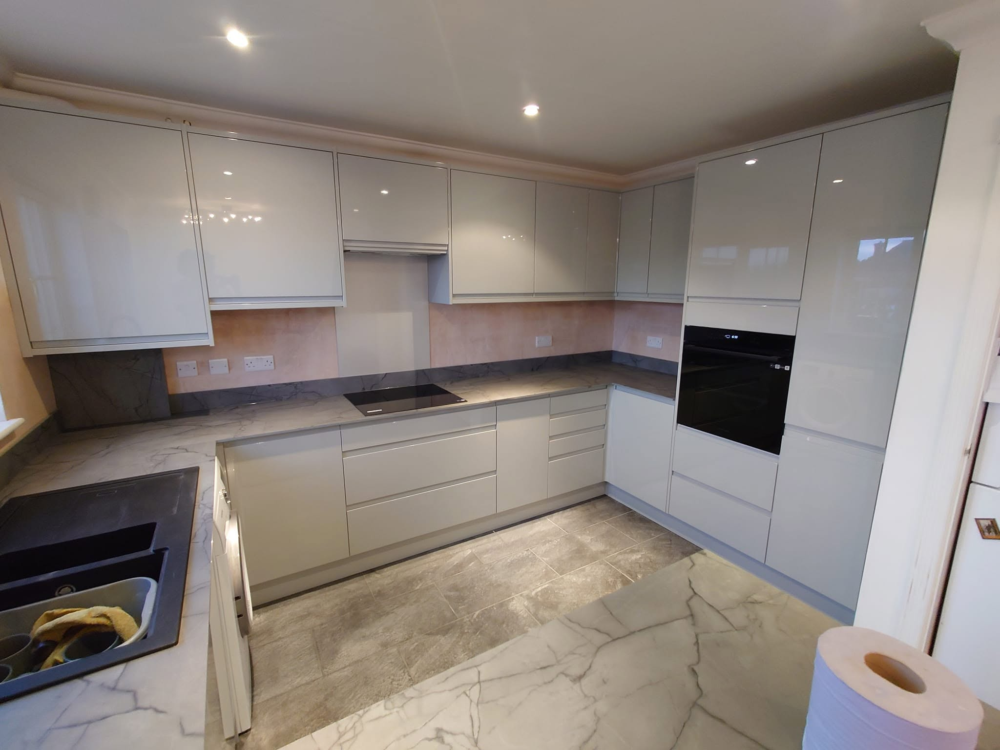

# Adding Real Images to Hammond Interiors Website

## Image Setup Guide

This guide walks you through downloading images from Facebook/Instagram and adding them to the website.

---

## Step 1: Create Image Folders

Create these directories in `C:\Users\richa\HammondWebsite\`:

```
images/
├── hero/
│   └── hero-bg.jpg           (Large kitchen/bathroom image for hero)
├── about/
│   └── team.jpg              (Team or installation work photo)
├── gallery/
│   ├── kitchen-1.jpg
│   ├── kitchen-2.jpg
│   ├── bathroom-1.jpg
│   ├── bathroom-2.jpg
│   ├── renovation-1.jpg
│   └── renovation-2.jpg
└── testimonials/
    └── (optional customer photos)
```

---

## Step 2: Download Images from Facebook

### Go to Facebook Page
1. Open: https://www.facebook.com/HammondInteriors1
2. Scroll through recent posts
3. Find kitchen/bathroom project photos

### Download Images (Right-Click Method)
1. Right-click on a photo
2. Select "Open image in new tab"
3. Right-click the image again
4. Select "Save image as..."
5. Save to `C:\Users\richa\HammondWebsite\images\gallery\`
6. Rename to: `kitchen-1.jpg`, `bathroom-1.jpg`, etc.

### Optimize Images Before Adding
1. **Reduce file size**:
   - Use online tools: TinyPNG.com, Compressor.io
   - Or use ImageMagick: `convert original.jpg -quality 85 optimized.jpg`
   
2. **Recommended sizes**:
   - Hero image: 1200x600px (or 1920x1000px)
   - Gallery images: 600x450px or 800x600px
   - About section: 400x500px

---

## Step 3: Update HTML with Real Images

Once you have images saved, I'll update the HTML to reference them.

### Example: Gallery Section
**Before** (Current placeholder):
```html
<div class="gallery-image">
    <svg viewBox="0 0 400 300">...</svg>
</div>
```

**After** (With real image):
```html
<div class="gallery-image">
    
</div>
```

### Example: Hero Section
**Before**:
```css
.hero-background {
    background-image: url('data:image/svg+xml,...');
}
```

**After**:
```css
.hero-background {
    background-image: url('images/hero/hero-bg.jpg');
}
```

---

## Image Requirements

### Hero Image (Background)
- **Size**: 1920x1200px (or 1200x600px minimum)
- **Format**: JPG
- **Content**: Large kitchen or bathroom project
- **Quality**: Professional, well-lit
- **File size**: < 300KB (after optimization)

### Gallery Images (6 needed)
- **Kitchens**: 2 images
- **Bathrooms**: 2 images  
- **Renovations**: 2 images
- **Size**: 800x600px (4:3 ratio) or 600x450px
- **Format**: JPG
- **Quality**: Professional finish photos
- **File size**: < 150KB each (after optimization)

### About Section Image
- **Size**: 400x500px (portrait)
- **Format**: JPG
- **Content**: Team photo, installation, or workspace
- **Quality**: Professional
- **File size**: < 100KB

---

## Instagram Images Alternative

If Facebook images aren't ideal, you can also download from:
https://www.instagram.com/hammond.interiors/

### Steps:
1. Open Instagram profile
2. Find recent kitchen/bathroom posts
3. Right-click → "Open image in new tab"
4. Right-click → "Save image as..."
5. Save and optimize as described above

---

## Tell Me When Ready

Once you've downloaded and saved the images in the folders:

1. **Confirm folder structure**: 
   - Do you have `images/gallery/kitchen-1.jpg`, etc.?

2. **Let me know the exact filenames**:
   - I'll update the HTML to reference them correctly

3. **Then I'll**:
   - Update `index.html` to use real images
   - Update `styles.css` for hero background
   - Ensure all images display correctly
   - Test responsive image loading

---

## Troubleshooting

### Images not showing?
- Check file paths are correct
- Verify images are in `images/` subfolder
- Open DevTools (F12) → Network tab
- Look for 404 errors for missing images

### Images loading slowly?
- Compress images more
- Use online tools: TinyPNG, Compressor.io
- Target under 150KB per image

### Wrong image dimensions?
- Use an image editor to resize
- Online: Pixlr.com, Canva.com
- Local: Paint, Photoshop, GIMP

---

## Quick Reference: Image Update Commands

After you provide images, I'll run commands like:

```powershell
# Check image files exist
ls C:\Users\richa\HammondWebsite\images\gallery\

# Verify file sizes
ls -lah C:\Users\richa\HammondWebsite\images\
```

---

## Next: Image Integration

Once images are ready, I will:

1. ✅ Update `index.html` gallery section with real image paths
2. ✅ Update `index.html` hero section with real hero image
3. ✅ Update `index.html` about section with team/workspace image
4. ✅ Update `styles.css` to reference hero background image
5. ✅ Add responsive image sizes for mobile/tablet/desktop
6. ✅ Test all images load correctly
7. ✅ Verify image responsiveness on all devices

---

## Pro Tips

### Optimize Before Uploading
- Use https://tinypng.com/ (drag & drop)
- Compress to 80-85% quality
- Target: < 200KB for gallery images

### Best Practice Naming
```
Clear: kitchen-1.jpg, bathroom-modern.jpg
Bad:  IMG_1234.jpg, photo.jpg
```

### File Organization
```
Keep organized:
images/
  ├── gallery/
  ├── hero/
  └── about/
```

### Image Alt Text
All images have descriptive alt text for:
- SEO (search engines)
- Accessibility (screen readers)
- User experience (if image fails to load)

---

**Ready to add images? Just:**
1. Download images from Facebook/Instagram
2. Save to the `images/` folder structure above
3. Tell me when done, and I'll integrate them into the HTML!

